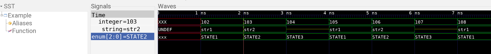

# fst-example

Example how to use the Fast Signal Trace (FST) format and library.

This uses the C library from GTKwave (via Verilator).
The library appears to not be packaged as a stand-alone library so
it has to be included in a bit non-conventional manner.

## Usage

Run `make wave` to execute the example and load it up in GTKwave.

## Samples

The `samples` directory contains potentially interesting FST files from the real world.
It can be used for playing with the library or as test vectors for an implementation.
